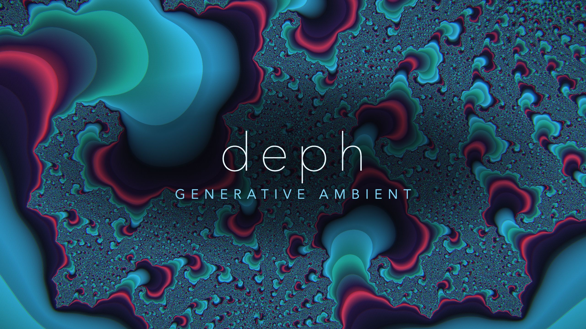
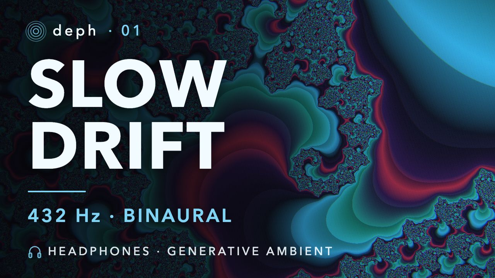

# deph — deep phase

Generative ambient music and fractal visuals, made as code.

Every piece is written in [Strudel](https://strudel.cc) (music as patterns), rendered to real audio headlessly in
Node, and paired with a [Remotion](https://www.remotion.dev) video whose fractal follows the music: its arc, its
energy, and each bell as it sounds. No drums, no fixed beat, slow arcs built from loops of different lengths
that keep recombining.

▶ **Listen and watch:** [deph on YouTube](https://www.youtube.com/channel/UC1cFX0dl77im5F5V-RRi6hA)



## Pieces

| # | Piece | Length | Notes |
|---|---|---|---|
| 01 | [Slow Drift](media/slow-drift/slow-drift.md) | 6:08 | C major, tuned to A = 432 Hz. Drone, sub-bass, pad and sparse bells, plus a quiet binaural layer (10 Hz easing down to 4 Hz, headphones only). A Julia-set fractal grows with the arc. |



## How it works

```
media/<piece>/sounds/<piece>.strudel   the music, as Strudel patterns (one arrange() timeline per voice)
        │  tools/sounds/render.mjs       real Strudel audio engine (superdough) in Node, no browser  -> sync/audio.wav
        │  tools/sounds/master.mjs       one constant gain to -16 LUFS / -1 dBTP, no compression   -> sync/audio-master.wav
        │  tools/sounds/frames.mjs       every event with its exact frame number                   -> sync/frames.json
        ▼
tools/visuals/src/compositions/<piece>/  Remotion video: a WebGL fractal driven by the audio and the events
        ▼
media/<piece>/renders/<piece>.mp4        the final video (git-ignored: several GB, regenerable)
```

Everything belonging to one piece lives in its own folder, `media/<piece>/`: the manifest
(`<piece>.deph.yaml`), its notes (`<piece>.md`), the sound, the visual (a link to the real code), the sync data, the
renders and the YouTube publish pack. [`CLAUDE.md`](CLAUDE.md) documents the layout and every tool in detail.

## Try it

Requirements: Node 22.15 or newer, and [ffmpeg](https://ffmpeg.org) on your `PATH` (used by the loudness master).

```bash
npm --prefix tools/sounds install
npm --prefix tools/visuals install

# 1. inspect a piece without audio: events, key estimate, piano roll
node tools/sounds/inspect.mjs media/slow-drift/sounds/slow-drift.strudel --summary --cycles 180

# 2. render it to audio, master it, and write the video keyframes
node tools/sounds/render.mjs media/slow-drift/sounds/slow-drift.strudel --cycles 180 --out media/slow-drift/sync/audio.wav --tail 8
node tools/sounds/master.mjs media/slow-drift/sync/audio.wav --out media/slow-drift/sync/audio-master.wav
node tools/sounds/frames.mjs media/slow-drift/sounds/slow-drift.strudel --cycles 180 --out-dir media/slow-drift/sync --audio media/slow-drift/sync/audio.wav

# 3. copy the audio and keyframes where Remotion reads them
cp media/slow-drift/sync/audio.wav          tools/visuals/public/slow-drift-audio.wav
cp media/slow-drift/sync/audio-master.wav   tools/visuals/public/slow-drift-master.wav
cp media/slow-drift/sync/frames.json        tools/visuals/public/slow-drift-frames.json

# 4. preview in Remotion Studio, or render the final video
cd tools/visuals
npx remotion studio
npx remotion render SlowDriftFractal ../../media/slow-drift/renders/slow-drift.mp4 --crf=25
```

The rendered audio and video are not in the repository (large and fully regenerable); the steps above rebuild them
from the Strudel source. To listen while editing, open a `.strudel` file in the
[Strudel VS Code extension](https://marketplace.visualstudio.com/items?itemName=cmillsdev.strudelvs) or paste it
into [strudel.cc](https://strudel.cc).

## Tuning and binaural layers, stated plainly

Slow Drift is tuned to A = 432 Hz (instead of 440 Hz) and includes a binaural layer that only works with headphones.
These are technical choices, not health claims: there is no good evidence that either one improves mood or health,
and this is music, not medical advice.

## Licence

Not chosen yet. Until one is added, the usual default applies (all rights reserved).
